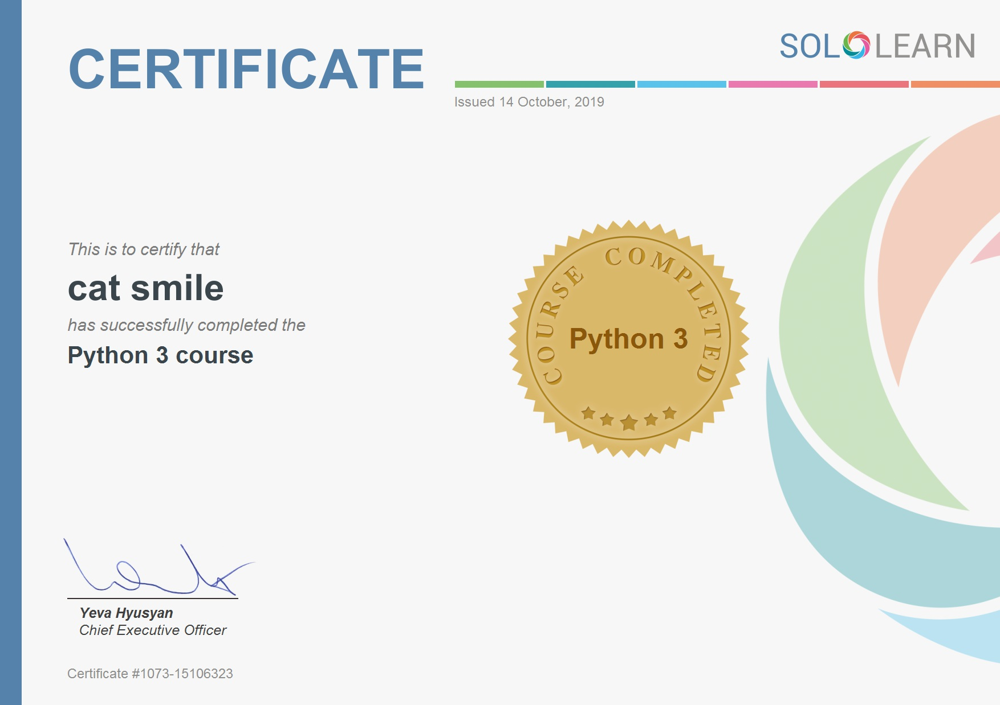

# Development
TBD

# \Misc  
Small projects / testings

# Courses & References
 

```
SoloLearn is an online and mobile learning platform that allows users to learn a variety of programming languages and concepts through short lessons, code challenges, and quizzes.
```
 > [AutomateTheBoringStuff](https://www.udemy.com/course/automate/)  
 > [Hackerrank/Python](https://www.hackerrank.com/domains/python?filters%5Bstatus%5D%5B%5D=unsolved&badge_type=python)  
 > [Hackerrank/ProblemSolving](https://www.hackerrank.com/domains/algorithms?filters%5Bstatus%5D%5B%5D=unsolved&filters%5Bdifficulty%5D%5B%5D=easy&badge_type=problem-solving)  
 > [Codewars/Python](https://www.codewars.com/kata/search/python?q=&&beta=false)  
